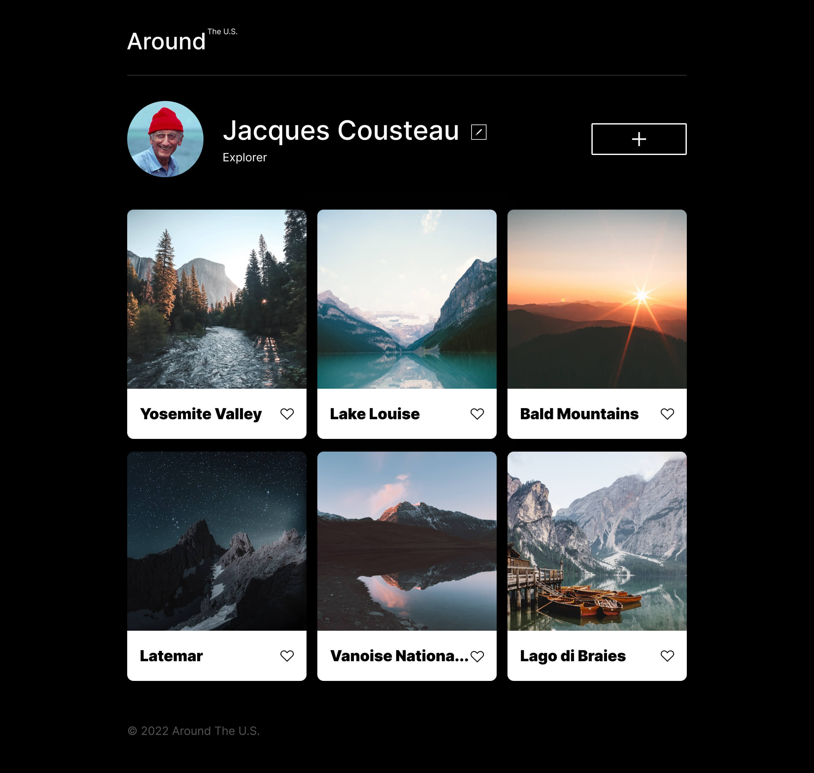
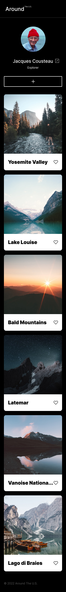

# Project 3: Around The U.S.

### Overview  

* Intro  
* Figma  
* Images  
  
**Intro**
  
Project 3: Around the U.S. features a 3-column photo set of Jacques Cousteau's explored landmarks.The page consists of the header/logo, customizable profile, cards to display the photos, and a footer. Includes like buttons and a button to add photos, as well as edit the profile description. This project is adaptive and works for all popular screen sizes. Layouts for cards were created using Flexbox. 
  
**Figma**  
  
* [Link to the project on Figma](https://www.figma.com/file/ii4xxsJ0ghevUOcssTlHZv/Sprint-3%3A-Around-the-US?node-id=0%3A1)  
  
**Images**  
  
  
